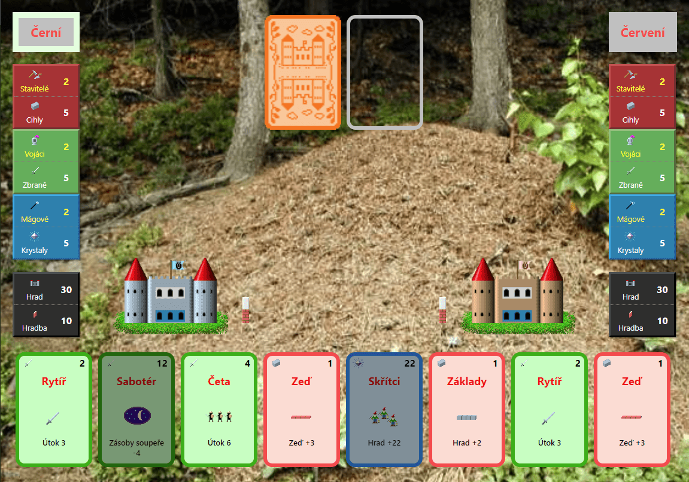

# Mravenci remake

Remake hry Mravenci jsem vytvořil v TypeScriptu, ReactJS, Redux a celé to builduje Vite.

Princip hry, grafiku a zvuky jsem převzal z původní hry Mravenci, kterou vymyslel a naprogramoval [Ing. Miroslav Němeček](https://www.breatharian.eu/Panda38/index.html).
Originální hru pro Windows a případně i samostatnou grafiku a zvuky si [můžete stáhnout ze stránek autora](https://www.breatharian.eu/sw/index.html) (zhruba v polovině stránky) pod licencí _"použijte tu z toho co chcete a kde chcete"_.

## Zbývá dodělat

-   [ ] responsivní design pro mobily
-   [ ] úvodní obrazovka
-   [ ] AI pro možnost hry jednoho hráče proti počítači
-   [ ] lokalizace do angličitny
